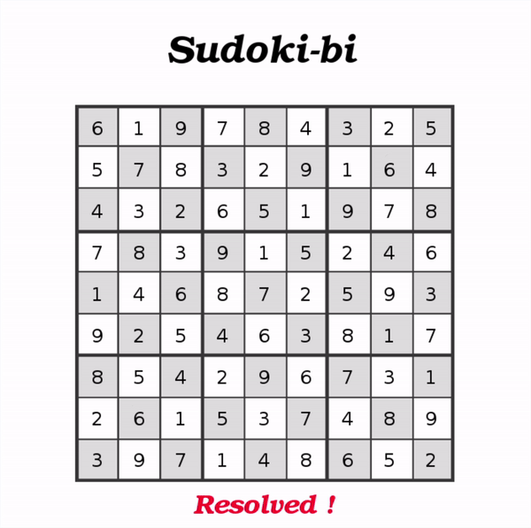

# Sudoku Solver

Sudoku Solver is a C executable. It resolves sudoku grids in a command line or a graphic way from a text description.



## Requirements

Building the Raytracer executable requires the following tools:
- X.org graphic system (see [www.x.org](https://www.x.org/wiki/))
```bash
sudo apt-get install xorg
```
- Simple Directmedia Layer library (see [www.libsdl.org](https://www.libsdl.org/))
```bash
sudo apt-get install libsdl1.2-dev libsdl-ttf2.0-dev
```

## Compilation

To build the executable, use:

```bash
make all
```

## Usage

To solve a sudoku, it requires a sudoku grid to be entered in the standard input.

```bash
./sudoki-bi [-c [-a] | -g] < [SUDOKU-GRID-FILE] 
```

The available options are:
- -g: graphic mode (uses the SDL library)
- -c: color mode (uses the command lines)
- -a: alternative mode (only for the command lines)

A sudoku grid is defined as:
```bash
|------------------|
| 7 4   5          |
|   2   3 7 8     6|
|           9   5 7|
| 4     7          |
| 9               3|
|           3     2|
| 1 5   9          |
| 2     1 4 7   9  |
|           2   1 4|
|------------------|
```

### Example

```bash
./sudoki-bi -g < sudoku/easy.txt
```

Some other examples are available in [`sudoku/`](sudoku/).

## License

Distributed under the [Apache License, Version 2.0](http://www.apache.org/licenses/). See [`LICENSE`](LICENSE) for more information.
